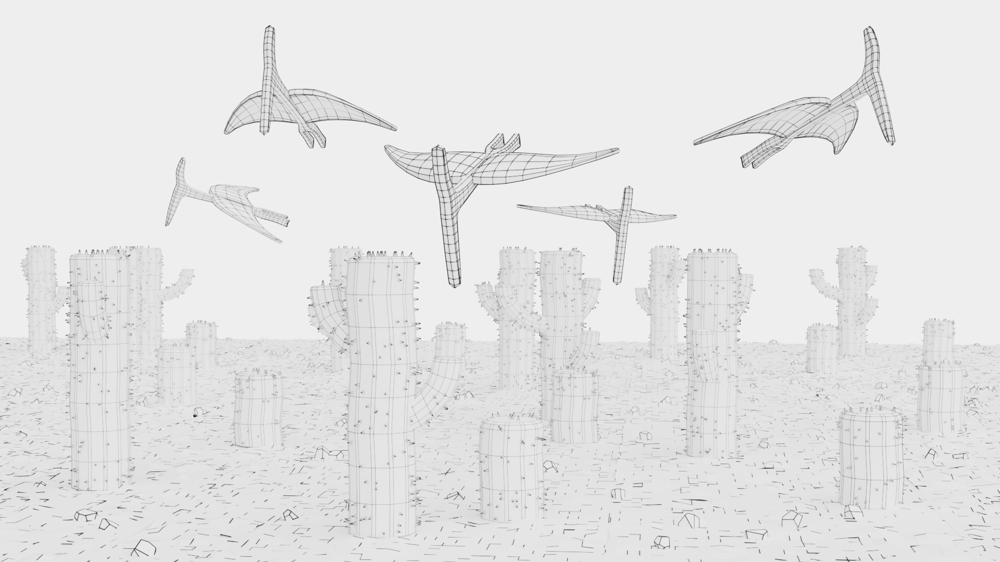

# Dino Dash 3D

Everyone has surely played the classic Chrome dinosaur game at least once. You control the T-Rex and jump over obstacles to avoid extinction. But what if you become the dinosaur and experience the game in 3D?
Dino Dash 3D is an exciting 3D remake of that game, built using A-Frame.

<!--  -->


## Description

Dino Dash 3D transforms the traditional 2D side-scrolling game into an immersive 3D experience. Navigate through a landscape, evading cacti and flying pteranodons.

## Live demo

The webpage is hosted on GitHub Pages. Check it out here - https://artem4852.github.io/3dino/. First time you load it would be clunky, but after you lost and restart it should be smooth.

## Features

- 3D graphics powered by A-Frame
- Procedurally generated obstacles (cacti and pteranodons)
- Dynamic difficulty increase as the game progresses
- Responsive design for both desktop and mobile (while it works on mobile, it's not optimized very well for it)
- Score tracking

## Getting Started

### Local installation

1. Clone the repository:
   ```
   git clone https://github.com/artem4852/3dino.git
   ```
2. Navigate to the project directory:
   ```
   cd 3dino
   ```
3. Open `index.html` in your web browser.

## How to Play

### Desktop Controls

- Jump: W key
- Crouch: C key
- Pause: Esc key

### Mobile Controls

- Jump: Swipe up
- Crouch: Swipe down
- Pause: Press the button at top right corner

## Development

The game is built using the following technologies:

- HTML5
- SASS
- JavaScript
- A-Frame

Key files:

- `index.html`: Main game structure and assets
- `level.js`: Game logic, obstacle generation, and scoring
- `camera.js`: Player movement and controls

## Contributing

Contributions are welcome! Please feel free to submit a Pull Request.

## License

This project is licensed under the MIT License.
